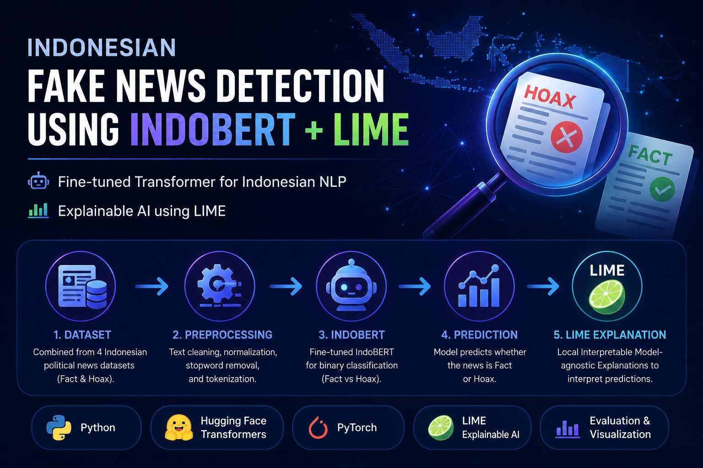
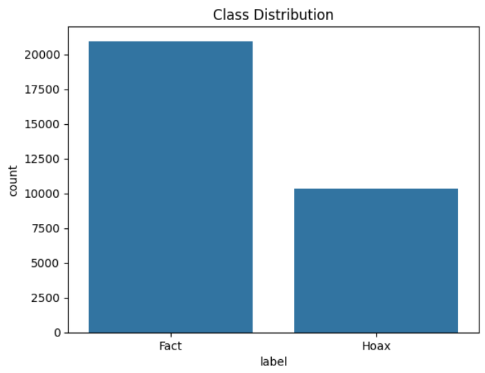
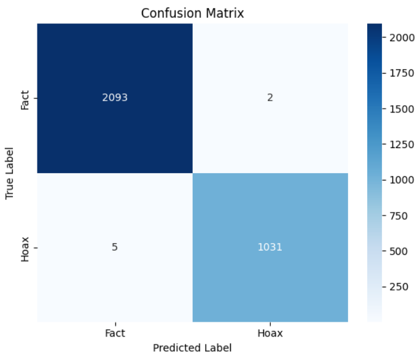
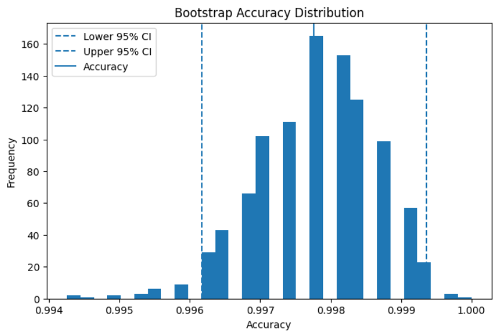
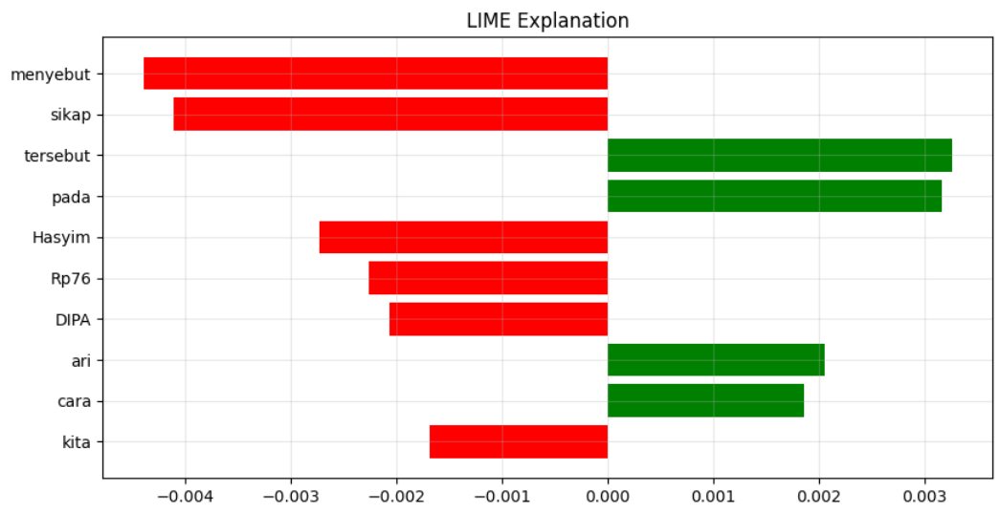
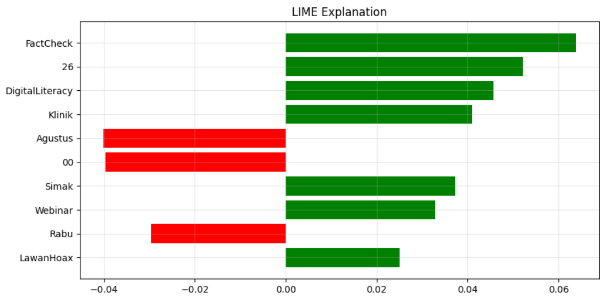

<p align="center">
  
</p>

<h1 align="center">
Indonesian Fake News Detection using IndoBERT and LIME
</h1>

<p align="center">
An end-to-end Indonesian fake news detection system using <b>IndoBERT</b> for text classification and <b>LIME</b> for Explainable Artificial Intelligence (XAI).
</p>

<p align="center">


</p>

<p align="center">
<a href="https://colab.research.google.com/github/rifkiramdani/indonesian-hoax-detection-indobert/blob/main/notebook/fake_news_detection_indobert.ipynb">

</a>
</p>

---

# 📑 Table of Contents

- [📖 Project Overview](#-project-overview)
- [✨ Highlights](#-highlights)
- [📊 Project Statistics](#-project-statistics)
- [🔄 Machine Learning Workflow](#-machine-learning-workflow)
- [🚀 Quick Start](#-quick-start)
- [📂 Repository Structure](#-repository-structure)
- [📰 Dataset](#-dataset)
- [🤖 Model Configuration](#-model-configuration)
- [📈 Performance](#-performance)
- [📉 Bootstrap Evaluation](#-bootstrap-evaluation)
- [🖼️ Visualizations](#️-visualizations)
- [🛠️ Technologies](#️-technologies)
- [🔮 Future Work](#-future-work)
- [📄 License](#-license)
- [🙏 Acknowledgements](#-acknowledgements)
- [📬 Contact](#-contact)
- [🌐 Related Projects](#-related-projects)

---

# 📖 Project Overview

Fake news has become one of the major challenges in the digital information era. The rapid dissemination of misinformation through online news portals and social media highlights the need for automated and reliable fake news detection systems.

This project presents an Indonesian fake news detection framework based on the **IndoBERT** transformer model combined with **LIME (Local Interpretable Model-Agnostic Explanations)** to provide transparent and interpretable predictions. The model was fine-tuned using a merged dataset of Indonesian factual and hoax news articles and evaluated using multiple classification metrics and bootstrap confidence intervals.

This repository focuses solely on the machine learning implementation, including data preprocessing, model fine-tuning, evaluation, bootstrap analysis, and prediction interpretability using LIME. It is intended as a portfolio project demonstrating an end-to-end Natural Language Processing (NLP) workflow for Indonesian fake news detection.

---

# ✨ Highlights

- 🎯 Achieved **99.78% Accuracy** on the test dataset.
- 🤖 Fine-tuned **IndoBERT Base P2** for Indonesian fake news detection.
- 🔍 Integrated **LIME** for Explainable Artificial Intelligence (XAI).
- 📊 Evaluated model robustness using **Bootstrap Confidence Interval**.
- ⚖️ Mitigated class imbalance using **Weighted CrossEntropyLoss**.
- 📰 Built using **31,310 Indonesian news articles**.
- 🇮🇩 Specifically designed for the Indonesian language.
- 📦 Fully documented and reproducible machine learning workflow.

---

# 📊 Project Statistics

| Item | Value |
|------|------|
| Model | IndoBERT Base P2 |
| Framework | PyTorch |
| Dataset | 31,310 News Articles |
| Dataset Source | Kaggle |
| Language | Indonesian |
| Classes | Fact / Hoax |
| Accuracy | 99.78% |
| Precision | 99.81% |
| Recall | 99.52% |
| F1-score | 99.66% |
| Explainability | LIME |
| Evaluation | Bootstrap Confidence Interval |

---

# 🔄 Machine Learning Workflow

```
Raw Dataset
      │
      ▼
Dataset Integration
      │
      ▼
Text Preprocessing
      │
      ▼
IndoBERT Tokenization
      │
      ▼
Class Weight Computation
      │
      ▼
Fine-tuning IndoBERT
      │
      ▼
Model Evaluation
      │
      ▼
Bootstrap Analysis
      │
      ▼
LIME Interpretation
```

---

# 🚀 Quick Start

## 1. Clone the Repository

```bash
git clone https://github.com/rifkiramdani/indonesian-hoax-detection-indobert.git
```

## 2. Navigate to the Project Directory

```bash
cd indonesian-hoax-detection-indobert
```

## 3. Install the Required Dependencies

```bash
pip install -r requirements.txt
```

## 4. Open the Notebook

This project is primarily developed using **Google Colab**, but it can also be executed locally using **Jupyter Notebook** or **JupyterLab**.

Open:

```text
notebook/fake_news_detection_indobert.ipynb
```

---

# 📂 Repository Structure

```
indonesian-hoax-detection-indobert
│
├── assets/
│   ├── banner.png
│   ├── bootstrap_distribution.png
│   ├── class_distribution.png
│   ├── confusion_matrix.png
│   ├── lime_fact.png
│   └── lime_hoax.png
│
├── dataset/
│   └── README.md
│
├── notebook/
│   └── fake_news_detection_indobert.ipynb
│
├── requirements.txt
├── LICENSE
├── README.md
└── .gitignore
```

---

# 📰 Dataset

The experiments were conducted using the publicly available **Indonesian Fact and Hoax Political News** dataset available on Kaggle.

The original dataset consists of four Microsoft Excel (`.xlsx`) files:

- `dataset_cnn_10k_cleaned.xlsx`
- `dataset_kompas_4k_cleaned.xlsx`
- `dataset_tempo_6k_cleaned.xlsx`
- `dataset_turnbackhoax_10k_cleaned.xlsx`

These four datasets were integrated into a single dataset, followed by duplicate removal, label normalization, and text preprocessing before model training and evaluation.

Final dataset statistics:

| Category | Count |
|----------|------:|
| Fact | 20,945 |
| Hoax | 10,365 |
| **Total** | **31,310** |

> **Note**
>
> The dataset is **not redistributed** in this repository. Please download it directly from the official Kaggle page. Additional information is available in the `dataset/README.md` file.

---

# 🤖 Model Configuration

| Parameter | Value |
|-----------|------|
| Model | IndoBERT Base P2 |
| Learning Rate | 2 × 10⁻⁵ |
| Batch Size | 16 |
| Maximum Sequence Length | 128 |
| Weight Decay | 0.01 |
| Optimizer | AdamW |
| Maximum Epochs | 5 |
| Early Stopping | Patience = 2 |
| Random Seed | 42 |

---

# 📈 Performance

| Metric | Score |
|---------|------:|
| Accuracy | **99.78%** |
| Precision | **99.81%** |
| Recall | **99.52%** |
| F1-score | **99.66%** |

The proposed IndoBERT model demonstrates excellent performance in distinguishing factual and hoax news while maintaining balanced precision and recall across both classes.

These results indicate that the proposed model provides robust and reliable performance for Indonesian fake news classification while maintaining high predictive consistency across repeated evaluations.

---

# 📉 Bootstrap Evaluation

Bootstrap resampling was conducted to evaluate the robustness and stability of the trained model.

| Metric | Value |
|---------|------|
| Accuracy | **99.78%** |
| 95% Confidence Interval | **99.62% – 99.94%** |

The narrow confidence interval demonstrates that the estimated model accuracy remains highly consistent across repeated bootstrap resampling, indicating strong prediction stability and reliability.

---

# 🖼️ Visualizations

## Class Distribution



---

## Confusion Matrix



---

## Bootstrap Accuracy Distribution



---

## LIME Interpretation (Fact News)



---

## LIME Interpretation (Hoax News)



---

# 🛠️ Technologies

| Category | Technology |
|-----------|------------|
| Programming Language | Python |
| Notebook | Google Colab |
| Deep Learning Framework | PyTorch |
| Transformer Library | Hugging Face Transformers |
| Pre-trained Language Model | IndoBERT Base P2 |
| Explainable AI | LIME |
| Data Processing | Pandas, NumPy |
| Visualization | Matplotlib |
| Model Evaluation | Scikit-learn |

---

# 🔮 Future Work

Possible future improvements include:

- 🌐 Developing a web-based fake news detection application.
- 📰 Expanding the dataset beyond political news to improve domain generalization.
- 🤖 Comparing IndoBERT with larger transformer architectures.
- 🔍 Integrating additional Explainable AI (XAI) techniques such as SHAP.
- ⚡ Supporting real-time news classification.

---

# 📄 License

This project is licensed under the **MIT License**.

You are free to use, modify, and distribute this project provided that proper attribution is given.

For more information, see the **LICENSE** file.

---

# 🙏 Acknowledgements

This project would not have been possible without the contributions of the following open-source communities and resources:

- 🤗 Hugging Face
- 🔥 PyTorch
- 📊 Scikit-learn
- 📓 Google Colab
- 📦 Kaggle
- 🇮🇩 IndoNLU / IndoBenchmark

Special thanks to all researchers and contributors who have made Indonesian NLP resources publicly available.

---

# 📬 Contact

**Rifki Ramdani**

- GitHub: https://github.com/rifkiramdani

---

# 🌐 Related Projects

Additional projects related to this repository will be added in the future.

Planned repositories:

- 🌐 Web-based Indonesian Fake News Detection System *(Coming Soon)*